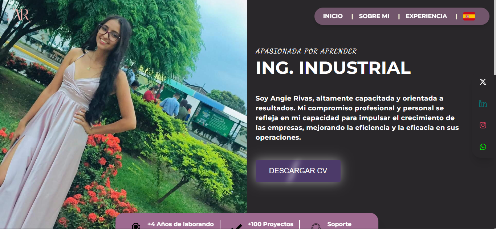
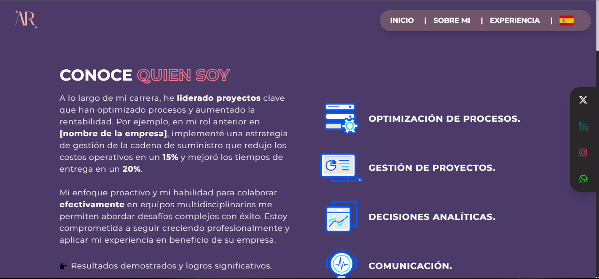

# Portafolio Web de Angie Rivas

¡Bienvenido al portafolio web de Angie Rivas! Este sitio web fue creado con el objetivo de mostrar las habilidades y proyectos de Angie de una manera atractiva y profesional.

## Acerca del Proyecto

El portafolio web de Angie fue diseñado y desarrollado con mucho amor y dedicación utilizando las últimas tecnologías web, incluyendo React.js y JavaScript. El objetivo principal era crear un sitio web moderno y visualmente atractivo que destacara las habilidades y proyectos de Angie de manera efectiva.

## Características Principales

- **Diseño Elegante y Minimalista:** El diseño del portafolio es limpio y minimalista, permitiendo que los proyectos y habilidades de Angie sean el foco principal.

- **Navegación Intuitiva:** La navegación por el sitio web es intuitiva y fácil de usar, lo que permite a los visitantes explorar el contenido de manera eficiente.

- **Sección de Proyectos Destacados:** Se incluye una sección dedicada a los proyectos destacados de Angie, donde se muestran en detalle con imágenes, descripciones y enlaces relevantes.

- **Información Personalizada:** Angie comparte información personalizada sobre ella misma, su experiencia, educación y habilidades, para que los visitantes puedan conocerla mejor.

## Visita el Portafolio

¡Puedes explorar el portafolio web de Angie en línea aquí: [Portafolio de Angie Rivas](https://portafolio-angie-rivas.vercel.app/)!

## Capturas de Pantalla

¡Aquí algunas capturas de pantalla del portafolio!

## Contribuciones

¡Las contribuciones y sugerencias son bienvenidas! Si tienes alguna idea para mejorar el portafolio de Angie, no dudes en abrir un problema o enviar una solicitud de extracción.

## Tecnologías Utilizadas

- React.js
- JavaScript
- HTML
- CSS

## Agradecimientos

¡Un agradecimiento especial a Angie Rivas por permitirme crear este portafolio web para ella y por ser una inspiración constante!
